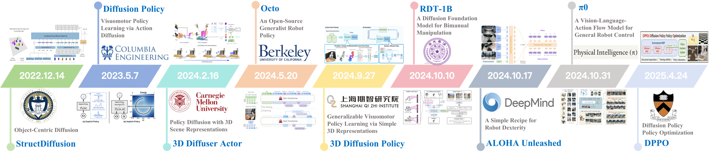

# Diffusion Policy in Robotic Manipulation
This repository contains a collection of resources and papers on ***Diffusion Models*** for ***Robotic Manipulation***.

🚀 Please check out our survey paper [ Diffusion Policy in Robotic Manipulation](https://arxiv.org/abs/)



## 📑Table of Contents
- 🤖[Diffusion Policy in Robotic Manipulation](#diffusion-policy-in-robotic-manipulation)
  - 📑[Table of Contents](#table-of-contents)
  - 📖[Papers](#papers)
    - 📊[Data Representation](#data-representation)
      - [2D Representation](#2d-representation)
      - [3D Representation](#3d-representation)
      - [Heterogeneous Data](#heterogeneous-data)
    - 🧠[Model Architecture](#model-architecture)
      - [Large Language Model + Diffusion](#large-language-model--diffusion)
      - [Small Size CNN or Transformer Model + Diffusion](#small-size-cnn-or-transformer-model--diffusion)
      - [VAE / VQ-VAE + Diffusion](#vae--vq-vae--diffusion)
    - 🌊[Diffusion Strategy](#diffusion-strategy)
      - [Incorporating Reinforcement Learning](#incorporating-reinforcement-learning)
      - [Diffusion Model + Equivariance](#diffusion-model--equivariance)
      - [Accelerated Sampling or Denoising Strategies](#accelerated-sampling-or-denoising-strategies)
      - [Employing Classifier (free) Guidance](#employing-classifier-free-guidance)
      - [Integration with Self-Supervised Learning](#integration-with-self-supervised-learning)
  - 🦾[Simulation Platform & Real-World Robot](#simulation-platform--real--word-robot)

  - 📜[Citation](#citation)

##  📖Papers
### 📊Data Representation

#### 2D Representation

- **LATENT ACTION PRETRAINING FROM VIDEOS**, ICLR 2025. [[paper](https://arxiv.org/abs/2410.11758)] [[code](https://github.com/LatentActionPretraining/LAPA)]

- **Human2Robot: Learning Robot Actions from Paired Human-Robot Videos**, arXiv 2025. [[paper](https://arxiv.org/abs/2502.16587)] [[code](https://github.com/jonyzhang2023/awesome-embodied-vla-va-vln)]
- **Mitigating the Human-Robot Domain Discrepancy in Visual Pre-training for Robotic Manipulation**, CVPR 2025. [[paper](https://arxiv.org/abs/2406.14235)] [[code](https://github.com/aCodeDog)]
- **Point Policy: Unifying Observations and Actions with Key Points for Robot Manipulation**, arXiv 2025. [[paper](https://arxiv.org/abs/2502.20391)] [[code](https://github.com/siddhanthaldar/Point-Policy)]
- **RDT-1B: a Diffusion Foundation Model for Bimanual Manipulation**, arXiv 2025. [[paper](https://arxiv.org/abs/2410.07864)] [[code](https://github.com/thu-ml/RoboticsDiffusionTransformer)]
- **MTDP: Modulated Transformer Diffusion Policy Model**, arXiv 2025. [[paper](https://arxiv.org/abs/2502.09029)]
- **S²-Diffusion: Generalizing from Instance-level to Category-level Skills in Robot Manipulation**, arXiv 2025. [[paper](https://arxiv.org/abs/2502.09389)] [[code](https://github.com/jonyzhang2023/awesome-embodied-vla-va-vln)]
- **GEVRM：Goal-Expressive Video Generation Model For Robust Visual Manipulation**, ICLR 2025. [[paper](https://arxiv.org/abs/2502.09268)]
- **Diffusion Trajectory-guided Policy for Long-horizon Robot Manipulation**, arXiv 2025. [[paper](https://arxiv.org/abs/2502.10040)]
- **Reflective Planning: Vision-Language Models for Multi-Stage Long-Horizon Robotic Manipulation**, arXiv 2025. [[paper](https://arxiv.org/abs/2502.16707)]
- **Learning an Actionable Discrete Diffusion Policy via Large-Scale Actionless Video Pre-Training**, NeurIPS 2024. [[paper](https://arxiv.org/abs/2402.14407)] [[code](https://github.com/tinnerhrhe/VPDD)]

- **Octo: An Open-Source Generalist Robot Policy**, RSS 2024. [[paper](https://arxiv.org/abs/2405.12213)] [[code](https://github.com/octo-models/octo)]

- **DiT-Block Policy：The Ingredients for Robotic Diffusion Transformers**, arXiv  2024. [[code](https://github.com/sudeepdasari/dit-policy)]
- **Hierarchical Diffusion Policy for Kinematics-Aware Multi-Task Robotic Manipulation**, CVPR 2024. [[paper](https://arxiv.org/abs/2403.03890)] [[code](https://github.com/dyson-ai/hdp)]
- **Diffusion Policy for Collision Avoidance in a Two-Arm Robot Setup**, ETH RC 2024. [[paper](https://www.research-collection.ethz.ch/handle/20.500.11850/675013)] 
- **ReorientDiff: Diffusion Model based Reorientation for Object Manipulation**, ICRA 2024. [[paper](https://arxiv.org/abs/2303.12700)] [[code](https://github.com/UtkarshMishra04/ReorientDiff)]
- **Crossway Diffusion: Improving Diffusion-based Visuomotor Policy via Self-supervised Learning**, ICRA 2024. [[paper](https://arxiv.org/abs/2307.01849)]
- **EDGI: Equivariant Diffusion for Planning with Embodied Agents**, NeurIPS 2023. [[paper](https://arxiv.org/abs/2303.12410)]
- **Diffusion Policy: Visuomotor Policy Learning via Action Diffusion**, arXiv 2023. [[paper](https://arxiv.org/abs/2303.04137)] [[code](https://github.com/real-stanford/diffusion_policy)]
- **Planning with Diffusion for Flexible Behavior Synthesis**, ICML 2022. [[paper](https://arxiv.org/abs/2205.09991)] [[code](https://github.com/jannerm/diffuser)]


#### Heterogeneous Data
- **RDT-1B: a Diffusion Foundation Model for Bimanual Manipulation**, arXiv 2025. [[paper](https://arxiv.org/abs/2410.07864)] [[code](https://github.com/thu-ml/RoboticsDiffusionTransformer)]
- **Universal Actions for Enhanced Embodied Foundation Models**, arXiv 2025. [[paper](https://arxiv.org/abs/2501.10105)] [[code](https://github.com/2toinf/UniAct)]
- **Scaling Proprioceptive-Visual Learning with Heterogeneous Pre-trained Transformers**, NeurIPS 2024. [[paper](https://arxiv.org/abs/2409.20537)] [[code](https://github.com/liruiw/HPT)]
- **PoCo: Policy Composition from and for Heterogeneous Robot Learning**, RSS 2024. [[paper](https://arxiv.org/abs/2402.02511)]

- **Π0: A Vision-Language-Action Flow Model for General Robot Control**, arXiv 2024. [[paper](https://arxiv.org/abs/2410.24164)]


#### 3D Representation
- **ADAMANIP: ADAPTIVE ARTICULATED OBJECT MANIPULATION ENVIRONMENTS AND POLICY LEARNING**, ICLR 2025. [[paper](https://arxiv.org/abs/2502.11124)]

- **GenDP: 3D Semantic Fields for Category-Level Generalizable Diffusion Policy**, CoRL 2024. [[paper](https://arxiv.org/abs/2410.17488)] [[code](https://github.com/WangYixuan12/gild)]
- **Generalizable Humanoid Manipulation with Improved 3D Diffusion Policies**, arXiv 2024. [[paper](https://arxiv.org/abs/2410.10803)] [[code](https://github.com/YanjieZe/Improved-3D-Diffusion-Policy)]
- **3D Diffusion Policy**, RSS 2024. [[paper](https://arxiv.org/abs/2403.03954)] [[code](https://github.com/YanjieZe/3D-Diffusion-Policy)]
- **3D Diffuser Actor: Policy Diffusion with 3D Scene Representations**, CoRL 2024. [[paper](https://arxiv.org/abs/2402.10885)] [[code](https://github.com/nickgkan/3d_diffuser_actor)]

- **DexGrasp-Diffusion: Diffusion-based Unified Functional Grasp Synthesis Method for Multi-Dexterous Robotic Hands**, arXiv 2024. [[paper](https://arxiv.org/abs/2407.09899)] [[code](https://github.com/showlab/Awesome-Robotics-Diffusion)]
- **DexDiffuser: Generating Dexterous Grasps with Diffusion Models**, arXiv 2024. [[paper](https://arxiv.org/abs/2402.02989)] [[code](https://github.com/YuLiHN/DexDiffuser)]
- **ManiCM: Real-time 3D Diffusion Policy via Consistency Model for Robotic Manipulation**, arXiv 2024. [[paper](https://arxiv.org/abs/2406.01586)] [[code](https://github.com/ManiCM-fast/ManiCM)]
- **Hierarchical Diffusion Policy for Kinematics-Aware Multi-Task Robotic Manipulation**, CVPR 2024. [[paper](https://arxiv.org/abs/2403.03890)] [[code](https://github.com/dyson-ai/hdp)]
- **DNAct: Diffusion Guided Multi-Task 3D Policy Learning**, arXiv 2024. [[paper](https://arxiv.org/abs/2403.04115)]
- **EquiBot: SIM(3)-Equivariant Diffusion Policy for Generalizable and Data Efficient Learning**, CoRL 2024. [[paper](https://arxiv.org/abs/2407.01479)] [[code](https://github.com/yjy0625/equibot)]

- **RoboKeyGen: Robot Pose and Joint Angles Estimation via Diffusion-based 3D Keypoint Generation**, ICRA 2024. [[paper](https://arxiv.org/abs/2403.18259)] [[code](https://github.com/Nimolty/RoboKeyGen)]
- **Bi3D Diffuser Actor: 3D Policy Diffusion for Bi-manual Robot Manipulation**, CoRL Workshop 2024. [[paper](https://openreview.net/forum?id=xcBz0l6yfa)]
- **RK-Diffuser（Hierarchical Diffusion Policy for Kinematics-Aware Multi-Task Robotic Manipulation）**, CVPR 2024. [[paper](https://arxiv.org/abs/2403.03890)] [[code](https://github.com/dyson-ai/hdp)]

- **ChainedDiffuser: Unifying Trajectory Diffusion and Keypose Prediction for Robotic Manipulation**, CoRL 2023. [[code](https://github.com/zhouxian/act3d-chained-diffuser)]
- **EQUIVARIANT DESCRIPTION FIELDS: SE(3)-EQUIVARIANT ENERGY-BASED MODELS FOR END-TO-END VISUAL ROBOTIC MANIPULATION LEARNING**, ICLR 2023. [[paper](https://arxiv.org/abs/2206.08321)] [[code](https://github.com/tomato1mule/edf)]
- **Shelving, Stacking, Hanging: Relational Pose Diffusion for Multi-modal Rearrangement**, CoRL 2023. [[paper](https://arxiv.org/abs/2307.04751)] [[code](https://github.com/anthonysimeonov/rpdiff)]
- **StructDiffusion: Object-Centric Diffusion for Semantic Rearrangement of Novel Objects**, RSS 2023. [[paper](https://arxiv.org/abs/2211.04604)] [[code](https://github.com/StructDiffusion/StructDiffusion)]


 ### 🧠Model Architecture

#### Large Language Model + Diffusion
- **ChatVLA: Unified Multimodal Understanding and Robot Control with Vision-Language-Action Model**, arXiv  2025. [[paper](https://arxiv.org/abs/2502.14420)]
- **RDT-1B: a Diffusion Foundation Model for Bimanual Manipulation**, arXiv 2025. [[paper](https://arxiv.org/abs/2410.07864)] [[code](https://github.com/thu-ml/RoboticsDiffusionTransformer)]
- **ChatVLA: Unified Multimodal Understanding and Robot Control with Vision-Language-Action Model**, arXiv 2025. [[paper](https://arxiv.org/abs/2502.14420)]
- **TinyVLA: Towards Fast, Data-Efficient Vision-Language-Action Models for Robotic Manipulation**, arXiv 2025. [[paper](https://arxiv.org/abs/2409.12514)]
- **LATENT ACTION PRETRAINING FROM VIDEOS**, ICLR 2025. [[paper](https://arxiv.org/abs/2410.11758)] [[code](https://github.com/LatentActionPretraining/LAPA)]
- **DemoGen: Synthetic Demonstration Generation for Data-Efficient Visuomotor Policy Learning**, arXiv 2025. [[paper](https://arxiv.org/abs/2502.16932)]


- **Multimodal Diffusion Transformer: Learning Versatile Behavior from Multimodal Goals**, RSS 2024. [[paper](https://arxiv.org/abs/2407.05996)] [[code](https://github.com/intuitive-robots/mdt_policy)]

- **Diffusion-VLA: Scaling Robot Foundation Models via Unified Diffusion and Autoregression**, arXiv 2024. [[paper](https://arxiv.org/abs/2412.03293)]

- **Octo: An Open-Source Generalist Robot Policy**, RSS 2024. [[paper](https://arxiv.org/abs/2405.12213)] [[code](https://github.com/octo-models/octo)]

- **Π0: A Vision-Language-Action Flow Model for General Robot Control**, arXiv 2024. [[paper](https://arxiv.org/abs/2410.24164)]
- **Plan Diffuser: Grounding LLM Planners with Diffusion Models for Robotic Manipulation**, CRL_WS 2024. [[paper](https://openreview.net/forum?id=2a3sgm5YeX)]
- **Scaling Robot Learning with Semantically Imagined Experience**, RSS 2023. [[paper](https://arxiv.org/abs/2302.11550)]

- **Compositional Foundation Models for Hierarchical Planning**, NeurIPS 2023. [[paper](https://arxiv.org/abs/2309.08587)] [[code](https://github.com/anuragajay/hip)]

#### Small Size CNN or Transformer Model + Diffusion


- **S²-Diffusion: Generalizing from Instance-level to Category-level Skills in Robot Manipulation**, arXiv 2025. [[paper](https://arxiv.org/abs/2502.09389)]
- **Diffusion Trajectory-guided Policy for Long-horizon Robot Manipulation**, arXiv 2025. [[paper](https://arxiv.org/abs/2502.10040)]
- **The Ingredients for Robotic Diffusion Transformers**, ICRA 2025. [[code](https://github.com/sudeepdasari/dit-policy)]
- **MTDP: Modulated Transformer Diffusion Policy Model**, arXiv 2025. [[paper](https://arxiv.org/abs/2502.09029)]
- **ChatVLA: Unified Multimodal Understanding and Robot Control with Vision-Language-Action Model**, arXiv 2025. [[paper](https://arxiv.org/abs/2502.14420)]
- **Reflective Planning: Vision-Language Models for Multi-Stage Long-Horizon Robotic Manipulation**, arXiv 2025. [[paper](https://arxiv.org/abs/2502.16707)]
- **ALOHA Unleashed: a transformer-based learning architecture trained with a diffusion loss**, CoRL 2024. [[paper](https://arxiv.org/abs/2410.13126)] [[code](https://github.com/aloha-unleashed/aloha_unleashed)]

- **Diffusion Policy for Collision Avoidance in a Two-Arm Robot Setup**, ETH RC 2024. [[paper](https://www.research-collection.ethz.ch/handle/20.500.11850/675013)] 


- **3D Diffusion Policy**, RSS 2024. [[paper](https://arxiv.org/abs/2403.03954)] [[code](https://github.com/YanjieZe/3D-Diffusion-Policy)]

- **3D Diffuser Actor: Policy Diffusion with 3D Scene Representations**, CoRL 2024. [[paper](https://arxiv.org/abs/2402.10885)] [[code](https://github.com/nickgkan/3d_diffuser_actor)]


- **Diffusion Model-Augmented Behavioral Cloning**, ICML 2024. [[paper](https://arxiv.org/abs/2302.13335)] [[code](https://github.com/NTURobotLearningLab/dbc)]

- **C3DM: Constrained-Context Conditional Diffusion Models for Imitation Learning**, TMLR 2024. [[paper](https://arxiv.org/abs/2311.01419)] [[code](https://github.com/showlab/Awesome-Robotics-Diffusion)]

- **Render and Diffuse: Aligning Image and Action Spaces for Diffusion-based Behaviour Cloning**, RSS 2024. [[paper](https://arxiv.org/abs/2405.18196)] [[code](https://github.com/vv19/rendiff)]

- **RK-Diffuser（Hierarchical Diffusion Policy for Kinematics-Aware Multi-Task Robotic Manipulation）**, CVPR 2024. [[paper](https://arxiv.org/abs/2403.03890)] [[code](https://github.com/dyson-ai/hdp)]

- **DexGrasp-Diffusion: Diffusion-based Unified Functional Grasp Synthesis Method for Multi-Dexterous Robotic Hands**, arXiv 2024. [[paper](https://arxiv.org/abs/2407.09899)] [[code](https://github.com/showlab/Awesome-Robotics-Diffusion)]
- **DexDiffuser: Generating Dexterous Grasps with Diffusion Models**, arXiv 2024. [[paper](https://arxiv.org/abs/2402.02989)] [[code](https://github.com/YuLiHN/DexDiffuser)]
- **Sparse Diffusion Policy: A Sparse, Reusable, and Flexible Policy for Robot Learning**, CoRL 2024. [[paper](https://arxiv.org/abs/2407.01531)] [[code](https://github.com/AnthonyHuo/SDP)]

- **Generate Subgoal Images before Act: Unlocking the Chain-of-Thought Reasoning in Diffusion Model for Robot Manipulation with Multi-modal Prompts**, CVPR 2024. [[paper](https://arxiv.org/abs/2310.09676)]
- **Plan Diffuser: Grounding LLM Planners with Diffusion Models for Robotic Manipulation**, CRL_WS 2024. [[paper](https://openreview.net/forum?id=2a3sgm5YeX)]

- **Subgoal Diffuser: Coarse-to-fine Subgoal Generation to Guide Model Predictive Control for Robot Manipulation**, ICRA 2024. [[paper](https://arxiv.org/abs/2403.13085)]

- **JUICER: Data-Efficient Imitation Learning for Robotic Assembly**, IROS 2024. [[paper](https://arxiv.org/abs/2404.03729)]
- **ALDM-Grasping: Diffusion-aided Zero-Shot Sim-to-Real Transfer for Robot Grasping**, IROS 2024. [[paper](https://arxiv.org/abs/2403.11459)] [[code](https://github.com/levyisthebest/ALDM-grasping)]
- **Scaling Robot Learning with Semantically Imagined Experience**, RSS 2023. [[paper](https://arxiv.org/abs/2302.11550)]
- **GenAug: Retargeting behaviors to unseen situations via Generative Augmentation**, RSS 2023. [[paper](https://arxiv.org/abs/2302.06671)] [[code](https://github.com/genaug)]
- **Learning Universal Policies via Text-Guided Video Generation**, NeurIPS 2023. [[paper](https://arxiv.org/abs/2302.00111)]

- **Diffusion models to generate rich synthetic expert data（AdaptDiffuser: Diffusion Models as Adaptive Self-evolving Planners）**, ICML 2023. [[paper](https://arxiv.org/abs/2302.01877)]
- **ZERO-SHOT ROBOTIC MANIPULATION WITH PRETRAINED IMAGE-EDITING DIFFUSION MODELS**, arXiv 2023. [[paper](https://arxiv.org/abs/2310.10639)] [[code](https://github.com/kvablack/susie)]
- **StructDiffusion: Object-Centric Diffusion for Semantic Rearrangement of Novel Objects**, RSS 2023. [[paper](https://arxiv.org/abs/2211.04604)] [[code](https://github.com/StructDiffusion/StructDiffusion)]
- **DALL-E-Bot: Introducing Web-Scale Diffusion Models to Robotics**, arXiv 2023. [[paper](https://arxiv.org/abs/2210.02438)]
- **ChainedDiffuser: Unifying Trajectory Diffusion and Keypose Prediction for Robotic Manipulation**, CoRL 2023. [[code](https://github.com/zhouxian/act3d-chained-diffuser)]
- **Scaling Up and Distilling Down: Language-Guided Robot Skill Acquisition**, CoRL 2023. [[paper](https://arxiv.org/abs/2307.14535)] [[code](https://github.com/real-stanford/scalingup)]
- **Motion Planning Diffusion: Learning and Planning of Robot Motions with Diffusion Models**, IROS 2023. [[paper](https://arxiv.org/abs/2308.01557)] [[code](https://github.com/jacarvalho/mpd-public)]
- **Generative Skill Chaining: Long-Horizon Skill Planning with Diffusion Models**, CoRL 2023. [[paper](https://arxiv.org/abs/2401.03360)] [[code](https://github.com/generative-skill-chaining/gsc-code)]
- **PlayFusion: Skill Acquisition via Diffusion from Language-Annotated Play**, CoRL 2023. [[paper](https://arxiv.org/abs/2312.04549)] [[code](https://github.com/shikharbahl/playfusion_dataset)]
- **Diffusion Policy: Visuomotor Policy Learning via Action Diffusion**, arXiv 2023. [[paper](https://arxiv.org/abs/2303.04137)] [[code](https://github.com/real-stanford/diffusion_policy)]
- **Scaling Robot Learning with Semantically Imagined Experience**, RSS 2023. [[paper](https://arxiv.org/abs/2302.11550)]

- **SE(3)-DiffusionFields: Learning smooth cost functions for joint grasp and motion optimization through diffusion**, ICRA 2023. [[paper](https://arxiv.org/abs/2209.03855)] [[code](https://github.com/robotgradient/grasp_diffusion)]

- **CACTI: A Framework for Scalable Multi-Task Multi-Scene Visual Imitation Learning**, arXiv 2022. [[paper](https://arxiv.org/abs/2212.05711)] [[code](https://github.com/cacti-framework/cacti-framework.github.io)]
- **Planning with Diffusion for Flexible Behavior Synthesis**, ICML 2022. [[paper](https://arxiv.org/abs/2205.09991)] [[code](https://github.com/jannerm/diffuser)]


#### VAE / VQ-VAE + Diffusion

- **LATENT ACTION PRETRAINING FROM VIDEOS**, ICLR 2025. [[paper](https://arxiv.org/abs/2410.11758)] [[code](https://github.com/LatentActionPretraining/LAPA)]
- **Universal Actions for Enhanced Embodied Foundation Models**, CVPR 2025. [[paper](https://arxiv.org/abs/2501.10105)] [[code](https://github.com/2toinf/UniAct)]
- **GEVRM：Goal-Expressive Video Generation Model For Robust Visual Manipulation**, ICLR 2025. [[paper](https://arxiv.org/abs/2502.09268)]
- **Discrete Policy: Learning Disentangled Action Space for Multi-Task Robotic Manipulation**, ICRA 2025. [[paper](https://arxiv.org/abs/2409.18707)]
- **Learning an Actionable Discrete Diffusion Policy via Large-Scale Actionless Video Pre-Training**, NeurIPS 2024. [[paper](https://arxiv.org/abs/2402.14407)] [[code](https://github.com/tinnerhrhe/VPDD)]


### 🌊Diffusion Strategy

#### Incorporating Reinforcement Learning


- **Diffusion Policy Policy Optimization**, arXiv 2024. [[paper](https://arxiv.org/abs/2409.00588)] [[code](https://github.com/irom-princeton/dppo)]
- **Diffusion Reward: Learning Rewards via Conditional Video Diffusion**, ECCV 2024. [[paper](https://arxiv.org/abs/2312.14134)] [[code](https://github.com/TEA-Lab/diffusion_reward)]

- **Reasoning with Latent Diffusion in Offline Reinforcement Learning**, ICLR 2024. [[paper](https://arxiv.org/abs/2309.06599)]

- **Learning a Diffusion Model Policy from Rewards via Q-Score Matching**, ICML 2024. [[paper](https://arxiv.org/abs/2312.11752)] [[code](https://github.com/Alescontrela/score_matching_rl)]
- **Policy Representation via Diffusion Probability Model for Reinforcement Learning**, arXiv 2024. [[paper](https://arxiv.org/abs/2305.13122)]

- **Diffusion-ES: Gradient-free Planning with Diffusion for Autonomous Driving and Zero-Shot Instruction Following**, arXiv 2024. [[paper](https://arxiv.org/abs/2402.06559)] [[code](https://github.com/bhyang/diffusion-es)]
- **EDGI: Equivariant Diffusion for Planning with Embodied Agents**, NeurIPS 2023. [[paper](https://arxiv.org/abs/2303.12410)]
- **Efficient Diffusion Policies for Offline Reinforcement Learning**, NeurIPS 2023. [[paper](https://arxiv.org/abs/2305.20081)] [[code](https://github.com/sail-sg/edp)]
- **Diffusion Model is an Effective Planner and Data Synthesizer for Multi-Task Reinforcement Learning**, arXiv 2023. [[code](https://github.com/tinnerhrhe/MTDiff)]
- **Planning with Diffusion for Flexible Behavior Synthesis**, ICML 2022. [[paper](https://arxiv.org/abs/2205.09991)] [[code](https://github.com/jannerm/diffuser)]


#### Diffusion Model + Equivariance

- **Diffusion-EDFs: Bi-equivariant Denoising Generative Modeling on SE(3) for Visual Robotic Manipulation**, CVPR 2024. [[paper](https://arxiv.org/abs/2309.02685)] [[code](https://github.com/tomato1mule/diffusion_edf)]
- **EquiBot: SIM(3)-Equivariant Diffusion Policy for Generalizable and Data Efficient Learning**, CoRL 2024. [[paper](https://arxiv.org/abs/2407.01479)] [[code](https://github.com/yjy0625/equibot)]
- **EDGI: Equivariant Diffusion for Planning with Embodied Agents**, NeurIPS 2023. [[paper](https://arxiv.org/abs/2303.12410)]


#### Accelerated Sampling or Denoising Strategies
- **Diffusion Policy Policy Optimization**, ICLR 2025. [[paper](https://arxiv.org/abs/2409.00588)] [[code](https://github.com/irom-princeton/dppo)]
- **Imit Diff: Semantics Guided Diffusion Transformer with Dual Resolution Fusion for Imitation Learning**, arXiv 2025. [[paper](https://arxiv.org/abs/2502.09649)]

- **ManiCM: Real-time 3D Diffusion Policy via Consistency Model for Robotic Manipulation**, arXiv 2024. [[paper](https://arxiv.org/abs/2406.01586)] [[code](https://github.com/ManiCM-fast/ManiCM)]

- **DiffuserLite: Towards Real-time Diffusion Planning**, NeurIPS 2024. [[paper](https://arxiv.org/abs/2401.15443)] [[code](https://github.com/diffuserlite/diffuserlite.github.io)]

- **RK-Diffuser：Hierarchical Diffusion Policy for Kinematics-Aware Multi-Task Robotic Manipulation**, CVPR 2024. [[paper](https://arxiv.org/abs/2403.03890)]
- **RoboKeyGen: Robot Pose and Joint Angles Estimation via Diffusion-based 3D Keypoint Generation**, ICRA 2024. [[paper](https://arxiv.org/abs/2403.18259)] [[code](https://github.com/Nimolty/RoboKeyGen)]
- **ReorientDiff: Diffusion Model based Reorientation for Object Manipulation**, ICRA 2024. [[paper](https://arxiv.org/abs/2303.12700)] [[code](https://github.com/UtkarshMishra04/ReorientDiff)]
- **Diff-DAgger: Uncertainty Estimation with Diffusion Policy for Robotic Manipulation**, CoRL 2024. [[paper](https://arxiv.org/abs/2410.14868)]
- **Π0: A Vision-Language-Action Flow Model for General Robot Control**, arXiv 2024. [[paper](https://arxiv.org/abs/2410.24164)]

- **IMITATING HUMAN BEHAVIOUR WITH DIFFUSION MODELS**, ICLR 2023. [[paper](https://arxiv.org/abs/2301.10677)] [[code](https://github.com/microsoft/Imitating-Human-Behaviour-w-Diffusion)]
- **Goal-Conditioned Imitation Learning using Score-based Diffusion Policies**, RSS 2023. [[paper](https://arxiv.org/abs/2304.02532)] [[code](https://github.com/intuitive-robots/beso)]
- **ChainedDiffuser: Unifying Trajectory Diffusion and Keypose Prediction for Robotic Manipulation**, CoRL 2023. [[code](https://github.com/zhouxian/act3d-chained-diffuser)]


#### Employing Classifier (free) Guidance

- **ReorientDiff: Diffusion Model based Reorientation for Object Manipulation**, ICRA 2024. [[paper](https://arxiv.org/abs/2303.12700)] [[code](https://github.com/UtkarshMishra04/ReorientDiff)]
- **Dynamics-Guided Diffusion Model for Sensor-less Robot Manipulator Design**, CoRL 2024. [[paper](https://arxiv.org/abs/2402.15038)]
- **SkillDiffuser: Interpretable Hierarchical Planning via Skill Abstractions in Diffusion-Based Task Execution**, CVPR 2024. [[paper](https://arxiv.org/abs/2312.11598)] [[code](https://github.com/Liang-ZX/SkillDiffuser)]
- **Goal-Conditioned Imitation Learning using Score-based Diffusion Policies**, RSS 2023. [[paper](https://arxiv.org/abs/2304.02532)] [[code](https://github.com/intuitive-robots/beso)]

- **Generative Skill Chaining: Long-Horizon Skill Planning with Diffusion Models**, CoRL 2023. [[paper](https://arxiv.org/abs/2401.03360)] [[code](https://github.com/generative-skill-chaining/gsc-code)]


#### Integration with Self-Supervised Learning

- **Multimodal Diffusion Transformer: Learning Versatile Behavior from Multimodal Goals**, RSS 2024. [[paper](https://arxiv.org/abs/2407.05996)] [[code](https://github.com/intuitive-robots/mdt_policy)]
- **Crossway Diffusion: Improving Diffusion-based Visuomotor Policy via Self-supervised Learning**, ICRA 2024. [[paper](https://arxiv.org/abs/2307.01849)]


## 🦾Simulation Platform & Real-World Robot

### Simulation Platform


<table class="custom-table">
  <thead>
    <tr>
      <th>Platform</th>
      <th>Physics Engine</th>
      <th>Robot</th>
      <th>Views</th>
      <th>Tasks</th>
      <th>Episodes</th>
    </tr>
  </thead>
  <tbody>
    <tr>
      <td>
        Meta-World<br>
        <span class="links">
          <a href="https://github.com/Farama-Foundation/Metaworld">[code]</a>
          <a href="https://arxiv.org/abs/1910.10897">[paper]</a>
        </span>
      </td>
      <td>MuJoCo</td>
      <td>4-DOF Sawyer</td>
      <td>behindGripper, corner, topview, gripperPOV</td>
      <td>50</td>
      <td>5K</td>
    </tr>
    <tr>
      <td>
        RLBench<br>
        <span class="links">
          <a href="https://github.com/stepjam/RLBench">[code]</a>
          <a href="https://arxiv.org/abs/1909.12271">[paper]</a>
        </span>
      </td>
      <td>V-REP</td>
      <td>7-DOF UR5, 6-DOF Mico, 6-DOF Jaco, 6-DOF Sawyer</td>
      <td>left shoulder, right shoulder, wrist, front</td>
      <td>18</td>
      <td>1.8K</td>
    </tr>
    <tr>
      <td>
        DEDO<br>
        <span class="links">
          <a href="https://github.com/contactrika/dedo">[code]</a>
          <a href="https://openreview.net/forum?id=WcY35wjmCBA">[paper]</a>
        </span>
      </td>
      <td>PyBullet</td>
      <td>7-DoF Franka</td>
      <td>sideview, eye in hand</td>
      <td>2</td>
      <td>-</td>
    </tr>
    <tr>
      <td>
        Libero<br>
        <span class="links">
          <a href="https://github.com/Lifelong-Robot-Learning/LIBERO">[code]</a>
          <a href="https://proceedings.neurips.cc/paper_files/paper/2023/hash/8c3c666820ea055a77726d66fc7d447f-Abstract-Datasets_and_Benchmarks.html">[paper]</a>
        </span>
      </td>
      <td>MuJoCo</td>
      <td>7-DOF Franka</td>
      <td>frontview, birdview, agentview, sideview</td>
      <td>130</td>
      <td>6.5K</td>
    </tr>
    <tr>
      <td>
        DoorGym<br>
        <span class="links">
          <a href="https://github.com/PSVL/DoorGym">[code]</a>
          <a href="https://arxiv.org/abs/1908.01887">[paper]</a>
        </span>
      </td>
      <td>PyBullet</td>
      <td>8-DoF BLUE, 7-DoF BLUE, 14-DOF Baxter</td>
      <td>static, gripperPOV, left shoulder, right shoulder, wrist, front</td>
      <td>3</td>
      <td>9K</td>
    </tr>
    <tr>
      <td>
        RoboMimic<br>
        <span class="links">
          <a href="https://github.com/ARISE-Initiative/robomimic">[code]</a>
          <a href="https://arxiv.org/abs/2108.03298">[paper]</a>
        </span>
      </td>
      <td>MuJoCo</td>
      <td>7-DOF Franka</td>
      <td>agentview, eye in hand</td>
      <td>8</td>
      <td>1.6K</td>
    </tr>
    <tr>
      <td>
        Isaac Lab<br>
        <span class="links">
          <a href="https://github.com/NVIDIA-Omniverse/IsaacLab">[code]</a>
        </span>
      </td>
      <td>PhysX, MuJoCo, Warp</td>
      <td>7-DOF Franka, 6-DOF UR5/10/16</td>
      <td>agentview, topview, eye in hand, sideview</td>
      <td>5</td>
      <td>-</td>
    </tr>
    <tr>
      <td>
        RoboCasa<br>
        <span class="links">
          <a href="https://github.com/robocasa/robocasa">[code]</a>
          <a href="https://arxiv.org/abs/2406.02523">[paper]</a>
        </span>
      </td>
      <td>MuJoCo</td>
      <td>12-DOF Franka</td>
      <td>center, left, right, frontview, eye in hand</td>
      <td>100</td>
      <td>5K</td>
    </tr>
    <tr>
      <td>
        ManiSkill3<br>
        <span class="links">
          <a href="https://github.com/haosulab/ManiSkill3">[code]</a>
          <a href="https://arxiv.org/abs/2312.03774">[paper]</a>
        </span>
      </td>
      <td>PhysX</td>
      <td>7-DOF Franka, 6-DOF WidowX-250S, Mobile Base & 7-DOF Fetch</td>
      <td>agentview, eye in hand</td>
      <td>20</td>
      <td>30K</td>
    </tr>
    <tr>
      <td>
        RoboCAS<br>
        <span class="links">
          <a href="https://github.com/yzrobotics/robocas">[code]</a>
          <a href="https://arxiv.org/abs/2310.08466">[paper]</a>
        </span>
      </td>
      <td>PhysX</td>
      <td>7-DOF Franka</td>
      <td>gripperPOV, agentview, static</td>
      <td>3</td>
      <td>7.3K</td>
    </tr>
    <tr>
      <td>
        IKEA-FAE<br>
        <span class="links">
          <a href="https://github.com/clvrai/furniture">[code]</a>
          <a href="https://arxiv.org/abs/1911.07246">[paper]</a>
        </span>
      </td>
      <td>ODE</td>
      <td>8-DOF Franka, 7-DOF Fetch, 14-DOF Baxter, 6-DOF Jaco</td>
      <td>-</td>
      <td>80</td>
      <td>-</td>
    </tr>
    <tr>
      <td>
        Colosseum<br>
        <span class="links">
          <a href="https://github.com/CodexLabsLLC/Colosseum">[code]</a>
        </span>
      </td>
      <td>PyRep</td>
      <td>7-DOF Franka</td>
      <td>left shoulder, right shoulder, wrist, front</td>
      <td>20</td>
      <td>2K</td>
    </tr>
    <tr>
      <td>
        D4RL<br>
        <span class="links">
          <a href="https://github.com/Farama-Foundation/D4RL">[code]</a>
          <a href="https://arxiv.org/abs/2004.07219">[paper]</a>
        </span>
      </td>
      <td>MuJoCo</td>
      <td>7-DOF Franka</td>
      <td>-</td>
      <td>4</td>
      <td>0.8K</td>
    </tr>
    <tr>
      <td>
        Gymnasium<br>
        <span class="links">
          <a href="https://github.com/Farama-Foundation/Gymnasium">[code]</a>
        </span>
      </td>
      <td>MuJoCo</td>
      <td>9-DoF Franka, Mobile Base & 7-DOF Fetch</td>
      <td>agentview, gripperPOV, eye in hand</td>
      <td>7/4</td>
      <td>-</td>
    </tr>
    <tr>
      <td>
        OmniIsaacGymEnvs<br>
        <span class="links">
          <a href="https://github.com/NVIDIA-Omniverse/OmniIsaacGymEnvs">[code]</a>
        </span>
      </td>
      <td>PhysX</td>
      <td>7-DOF Franka</td>
      <td>agentview, topview, eye in hand, sideview</td>
      <td>5</td>
      <td>-</td>
    </tr>
    <tr>
      <td>
        CALVIN<br>
        <span class="links">
          <a href="https://github.com/mees/calvin">[code]</a>
          <a href="https://arxiv.org/abs/2112.03227">[paper]</a>
        </span>
      </td>
      <td>PyBullet</td>
      <td>7-DOF Franka</td>
      <td>static, gripperPOV</td>
      <td>34</td>
      <td>20K</td>
    </tr>
    <tr>
      <td>
        Orbit<br>
        <span class="links">
          <a href="https://github.com/NVIDIA-Omniverse/Orbit">[code]</a>
        </span>
      </td>
      <td>PhysX</td>
      <td>7-DOF LBR iiwa, 6-DOF UR10, Mobile Base & 7-DOF Franka</td>
      <td>agentview, topview, eye in hand, sideview</td>
      <td>-</td>
      <td>-</td>
    </tr>
    <tr>
      <td>
        Habitat Lab<br>
        <span class="links">
          <a href="https://github.com/facebookresearch/habitat-lab">[code]</a>
          <a href="https://arxiv.org/abs/1904.01201">[paper]</a>
        </span>
      </td>
      <td>PyBullet</td>
      <td>7-DOF Franka, Mobile Base & 7-DOF Fetch/Stretch</td>
      <td>eye in hand, agentview, sideview</td>
      <td>6</td>
      <td>70K</td>
    </tr>
  </tbody>
</table>

### Real robot


## 📜Citation
```
@article{,
  title={Diffusion Policy in Robotic Manipulation},
  author={},
  journal={arXiv preprint },
  year={2025}
}
```
